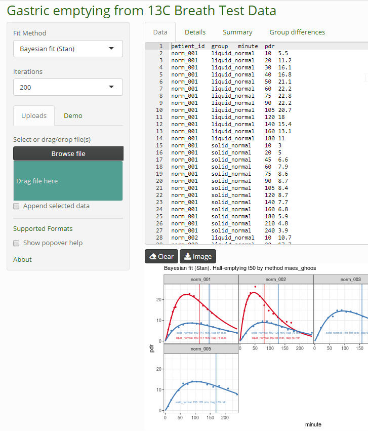

# breathteststan: Bayesian fit to 13C Breath Test Time series for gastric emptying

Dieter Menne  
Menne Biomed Consulting Tübingen, Germany  
<https://www.menne-biomed.de>  
[dieter.menne\@menne-biomed.de](mailto:dieter.menne@menne-biomed.de)

<!-- badges: start -->

   

<!-- badges: end -->

Dieter Menne Menne Biomed Consulting <https://www.menne-biomed.de>

[dieter.menne\@menne-biomed.de](mailto:dieter.menne@menne-biomed.de)

Fit 13C time series data with Bayesian methods using [Stan](https://mc-stan.org/). This is an add-on to package [breathtestcore](https://github.com/dmenne/breathtestcore). The Stan functions have been moved to this package to avoid long compile and test times.

 
