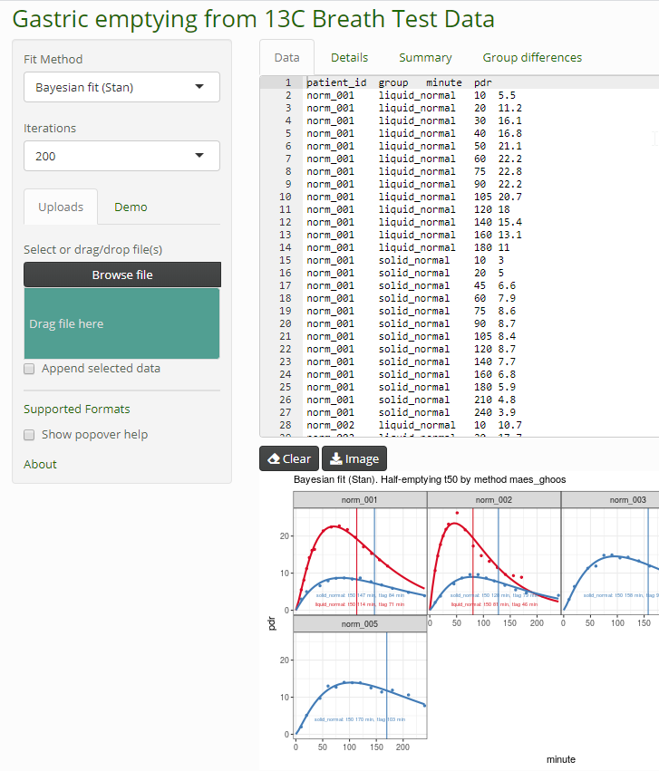
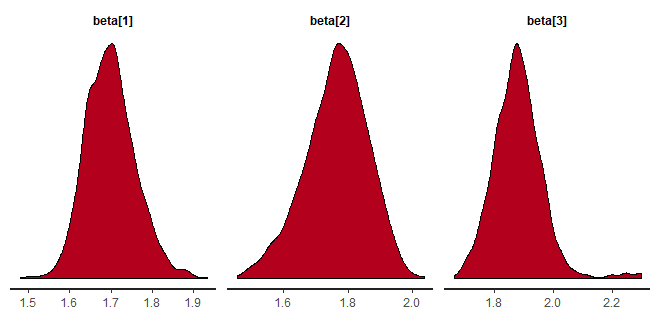

# breathteststan: Bayesian fit to 13C Breath Test Time series for gastric emptying

Dieter Menne  
Menne Biomed Consulting Tübingen, Germany  
<https://menne-biomed.de>  
<dieter.menne@menne-biomed.de>

Dieter Menne Menne Biomed Consulting <https://menne-biomed.de>

<dieter.menne@menne-biomed.de>

Fit 13C time series data with Bayesian methods using
[Stan](https://mc-stan.org/). This is an add-on to package
[breathtestcore](https://github.com/dmenne/breathtestcore). The Stan
functions have been moved to this package to avoid long compile and test
times.

